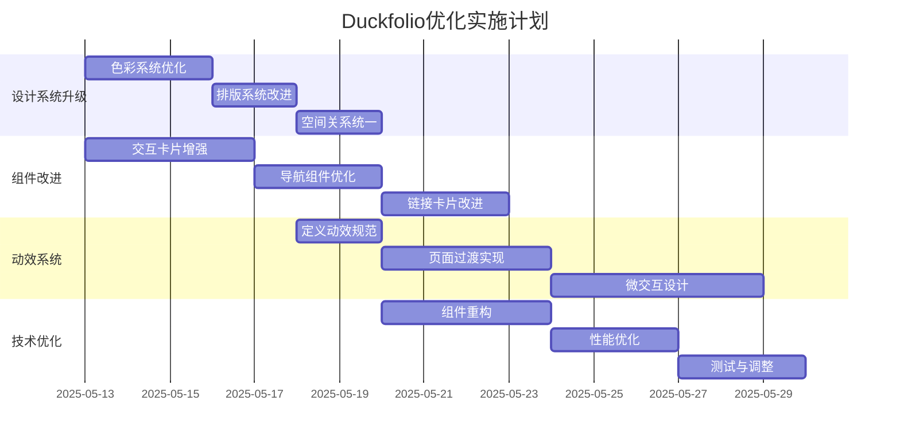

# Duckfolio项目优化方案

## 项目概述

Duckfolio是一个基于Next.js 15、React 19和Tailwind CSS构建的个人主页项目，具有现代化的UI设计和交互效果。项目目前已实现了基本的个人信息展示、社交链接和网站链接功能，并支持深色/浅色模式切换。

## 分析与目标

经过对项目代码的分析，我们制定了以下优化目标：

1. **提升视觉质量** - 保持极简主义风格，增强精致感和专业度
2. **优化交互体验** - 添加微妙但有意义的动效，提升用户体验
3. **增强设计一致性** - 统一设计语言，确保视觉和交互的连贯性
4. **技术栈优化** - 利用最新技术实现上述目标

## 优化方案

### 1. 视觉设计提升

#### 1.1 色彩系统改进

- **当前主题色（橙色系列）保留，但优化色彩过渡和应用方式**
  - 创建更精细的色彩变量，基于主题色构建完整色板
  - 更好地利用HSL色彩空间，实现更自然的色彩变化
  - 在theme.css中扩展色彩变量定义

- **引入更精细的亮度层次**
  - 为主题色创建5-7个亮度级别，方便在不同场景使用
  - 保持色相一致性，仅在饱和度和亮度上微调
  - 例：`--theme-primary-50`到`--theme-primary-900`

- **为深色/浅色模式分别优化色彩方案**
  - 深色模式下提高对比度，保证可读性
  - 深色模式中降低主题色饱和度，减少视觉疲劳
  - 确保所有交互元素在两种模式下都有足够对比度

#### 1.2 排版系统升级

- **实现更精致的字体比例系统**
  - 基于黄金比例（1.618）设计字体大小梯度
  - 统一标题和正文的字体比例关系
  - 在Tailwind配置中自定义排版scales

- **优化文本间距和行高**
  - 为标题设置更紧凑的行高（1.1-1.2）
  - 为正文设置更适合阅读的行高（1.5-1.6）
  - 优化字符间距，特别是大标题

- **增加字重变化**
  - 使用更多字重变化强化层次感（300/400/500/700）
  - 为不同级别标题设定合适字重
  - 强调文本使用中等字重而非颜色变化

#### 1.3 空间利用优化

- **重新审视页面留白**
  - 基于8px网格系统调整所有间距
  - 创造更有节奏的视觉流，增加呼吸空间
  - 保持信息密度的同时优化留白

- **统一组件间距**
  - 建立一致的间距变量（xs/sm/md/lg/xl）
  - 优化卡片内边距和元素间距
  - 确保间距随响应式布局变化保持视觉平衡

- **优化响应式布局断点**
  - 审查当前断点设置，优化移动端体验
  - 为平板设备增加专门的布局优化
  - 确保大屏幕显示时内容不会过度拉伸

### 2. 组件设计改进

#### 2.1 交互卡片增强

- **优化3D效果**
  - 调整透视比例，使3D效果更加微妙自然
  - 平滑动画缓动函数，减少生硬感
  - 优化移动端的交互体验

- **添加精致的光影效果**
  - 增加环境反射效果，增强真实感
  - 优化高光和阴影过渡，强化质感
  - 根据交互状态动态调整光影

- **改进边缘处理**
  - 添加微妙的边缘高光
  - 实现更自然的边缘阴影
  - 优化圆角与边框结合效果

#### 2.2 导航与标题优化

- **更流畅的导航切换动画**
  - 重新设计下划线过渡效果
  - 优化导航项激活状态变化
  - 增加微妙的颜色过渡

- **改进标题动画**
  - 优化"Hello, I'm"动画，使其更加自然
  - 调整波动时间和幅度，保持优雅
  - 实现更精细的字母动画控制

- **优化活动状态指示器**
  - 设计更精致的活动状态指示
  - 添加微妙的动画过渡
  - 确保移动端可见性

#### 2.3 链接卡片改进

- **增加微妙的悬停状态变化**
  - 设计更精致的卡片悬停效果
  - 添加细微的背景色和阴影变化
  - 实现平滑的渐变背景过渡

- **优化卡片内部布局和排版**
  - 改进图标与文本的视觉平衡
  - 优化空间分配和内部间距
  - 提高可读性和视觉层次

- **添加精致的过渡效果**
  - 实现平滑的进入/离开动画
  - 优化内容加载序列
  - 添加微妙的点击反馈

### 3. 交互体验增强

#### 3.1 微交互设计

- **增强页面过渡**
  - 实现页面内容平滑切换
  - 设计自然的元素进入/离开序列
  - 优化动画时长和缓动函数

- **光标交互优化**
  - 改进自定义光标视觉效果
  - A为不同交互区域定制光标行为
  - 添加微妙的磁吸效果于关键元素

- **滚动体验增强**
  - 实现平滑的微视差滚动
  - 添加基于滚动位置的渐显动画
  - 优化滚动性能和流畅度

#### 3.2 动效系统设计

- **统一动画规范**
  - 建立一致的动画时间系统
    - 极快：100-150ms
    - 标准：200-300ms
    - 强调：400-500ms
  - 定义统一的缓动函数
    - 基本：cubic-bezier(0.25, 0.1, 0.25, 1.0)
    - 进入：cubic-bezier(0.0, 0.0, 0.2, 1.0)
    - 离开：cubic-bezier(0.4, 0.0, 1, 1)
  - A创建可复用的动画组件

- **细节动画增强**
  - 优化文字动画，提高自然度
  - 为图标添加微妙的状态变化
  - 实现精致的加载和过渡状态

### 4. 技术优化与组件推荐

#### 4.1 现有技术栈优化

- **充分利用Framer Motion**
  - 使用AnimatePresence优化内容切换
  - 实现更复杂的手势交互
  - 利用MotionValues创建联动动画

- **优化Tailwind CSS配置**
  - 扩展主题配置，支持更精细的设计系统
  - 创建可复用的自定义组件类
  - 优化动画和过渡的辅助类

- **使用Next.js 15最新特性**
  - 利用服务器组件优化性能
  - 实现更高效的资源加载
  - 优化页面加载速度

#### 4.2 推荐集成的Magic UI组件

- **文字动画组件**
  - `text-reveal` - 实现平滑文字揭示效果
  - `animated-gradient-text` - 为标题添加精致渐变
  - `typing-animation` - 实现打字机效果

- **交互增强组件**
  - `magic-card` - 提升卡片交互质感
  - `shine-border` - 为重要元素添加发光边框
  - `blur-fade` - 实现自然的元素过渡

- **背景效果组件**
  - `dot-pattern` - 创建极简风格的背景点阵
  - `ripple` - 添加优雅的交互波纹效果
  - `animated-grid-pattern` - 实现微妙的背景纹理

## 实施路线图

## 实施优先级与阶段划分

### 阶段一：基础设计系统优化（1-2周）

1. **设计系统定义**
   - 完善色彩系统
   - 优化排版规范
   - 统一间距和布局规则

2. **核心视觉调整**
   - 应用新的色彩方案
   - 更新排版样式
   - 优化基础布局

### 阶段二：组件优化与交互提升（2-3周）

1. **交互卡片改进**
   - 增强3D效果质量
   - 优化光影和质感
   - 改进响应式适配

2. **导航与内容组件**
   - 优化导航体验
   - 改进标题动画
   - 增强链接卡片交互

3. **基础动效实现**
   - 应用动效设计规范
   - 实现页面切换动画
   - 优化元素进入/离开效果

### 阶段三：高级交互与集成（2周）

1. **高级交互实现**
   - 完善微交互系统
   - 优化光标与滚动体验
   - 增加细节动画效果

2. **Magic UI组件集成**
   - 集成选定的UI增强组件
   - 适配项目设计风格
   - 优化性能和可访问性

3. **最终测试与调整**
   - 跨浏览器兼容性测试
   - 性能优化
   - 细节打磨与完善

## 结论

本优化计划旨在通过精心设计的视觉和交互改进，提升Duckfolio项目的整体质量和用户体验。我们将在保持极简主义风格的同时，增加精致的细节和流畅的交互体验，使网站更具现代感和专业度。

通过分阶段实施，我们可以确保每一步改进都经过充分测试和优化，最终打造出兼具美观和实用性的个人主页。
